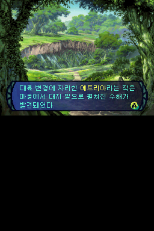

# 세계수의 미궁 한글 패치 — 베타 1

닌텐도 DS용 「世界樹の迷宮」(세계수의 미궁, ATLUS 2007) 한국어 번역 패치입니다.
**베타판**이라 번역 검토가 다 끝나지 않았습니다 (아래 「베타 안내」).

> **피드백·버그 제보는 Discord 로**: **https://discord.gg/3qQ3drmwQV** (장소·인물·앞뒤 대사와 스크린샷을 함께 올려 주세요)

비공식 팬 번역입니다. 이 패치에는 게임 롬이 들어 있지 않으며, 원본 게임은 직접 준비해야 합니다.

## 내려받기

[Releases](https://github.com/beck4679-alt/SekaijuNoMeikyuu-KR/releases) 에서 `Sekaiju_KR_beta1.zip` (패치 + 이 설명 + 글꼴 라이선스)

## 필요한 원본

| 항목 | 값 |
|---|---|
| 판본 | Sekaiju no Meikyuu (Japan) (世界樹の迷宮, 2007, ATLUS) |
| 게임 코드 | `AKYJ` |
| 크기 | 16,777,216바이트 (128Mbit) |
| CRC32 | `EB27DA6E` |
| SHA-1 | `0d2b41a539c45813d83d55cf2b25a941630b5cdb` |
| SHA-256 | `e340096ac30a143df28262c312caccffe464882f2d24c1da72fe14010a44192d` |

## 적용 방법

패치 파일 `Sekaiju_KR_beta1.xdelta`의 형식은 xdelta(VCDIFF)입니다.

- 웹: [Rom Patcher JS](https://www.marcrobledo.com/RomPatcher.js/) 에서 원본 롬과 패치를 고르고 적용
- Windows: xdelta UI · Delta Patcher 에서 원본 롬과 패치를 고르고 적용
- 명령줄: `xdelta3 -d -s 원본.nds Sekaiju_KR_beta1.xdelta 세계수의미궁_한글.nds`

적용 결과:

| 항목 | 값 |
|---|---|
| 크기 | 16,777,216바이트 |
| CRC32 | `6107A454` |
| SHA-256 | `2f61a8b75721b87845fbe423e8af9a348e3ad6e15102efdf4ed0d3c61c7f7787` |

원본이 다르면(다른 판, 손댄 롬) 패치 안의 결과 체크섬이 맞지 않아 적용 도구가 멈춥니다.

패치 파일: 1,380,631바이트, SHA-256 `e4eb5c84594c0a30069b3d66fca64c2e13114a133910d2298bb2222aa6655ecd`

## 번역한 것

- 대사·메뉴·시스템 문구 전부 (메시지 8,416개): 이벤트·의뢰·미션·시설 대화, 전투·캠프·세이브 문구
- 아이템·적·스킬·퀘스트 이름과 설명
- 이름 입력(길드·캐릭터): 두벌식 한글 조합 입력 (완성형 2,350자)
- 그림으로 된 글자: 타이틀 로고, 층위 로고 12장, 층 시작 연출 부제, 던전 안내(위층·아래층·조사·열기 등), 캠프·상태 화면 라벨, 시설 띠, 전투 버프·정보 줄, 지도 그리기 안내, 지도 메모 입력판 버튼
- 그대로 둔 것: 스태프 롤(영문), 원래 영어인 표기(ITEM·SKILL 같은 메뉴, 지도 아이콘 목록 EVENT·TREASURE 등)

## 알아 둘 것

- **지도 메모는 영문·숫자·기호만** 쓸 수 있습니다. 원래 게임이 메모 글을 글자당 9비트로 저장해 한글이 들어가지 않기 때문입니다(메모 입력판은 영문 쪽으로 열림).
- **세이브**: 세이브 형식은 바꾸지 않았지만 일본판 세이브를 불러오는 것은 확인하지 않았습니다. 일본판에서 가나로 지은 길드·캐릭터 이름은 한글 자리의 엉뚱한 글자로 보이므로 새로 시작하는 것을 권합니다.
- **확인한 실행 환경**: DeSmuME 0.9.12, BizHawk 2.11.1 (melonDS 코어). 실기·플래시카트는 확인하지 않았습니다(롬 안 ARM7 코드 자리를 옮겼습니다).

## 베타 안내 — 아직 확인이 끝나지 않은 것

- **번역**: 초벌 번역 뒤 이야기 대사(이벤트·의뢰·미션·시설 대화)와 전투·시스템 문구, 아이템·스킬·몬스터 설명은 2차 검토를 거쳤고 전체를 기계 검사했지만, 사람의 최종 검토는 아직입니다. 어색한 문장이나 오역이 남아 있을 수 있습니다.
- **처음부터 끝까지 실제로 플레이해 보지는 않았습니다.** 장면별 확인(타이틀·마을·시설·던전·전투·이름 입력·지도 메모·층위 연출)과 자동 검사(번역 길이·버퍼 검사, 무작위 입력 자동 플레이 약 10시간 분량 — 1-26층, 보스 19종 강제 전투 포함)로 대신했습니다. 그 과정에서 찾은 멈춤(길드 파티 편성)과 전투 문구 깨짐은 고쳤지만, 진행이 막히는 문제가 없다고 보장하지는 못합니다.
- **마지막 보스를 쓰러뜨린 뒤의 결말 문장**은 게임 흐름 안에서 띄워 보지 못했습니다(글자 수·줄 폭만 검사).

## 오류 제보

오역·오타·어색한 문장·깨지는 화면을 발견하면 [Discord](https://discord.gg/3qQ3drmwQV) 나 [Issues](https://github.com/beck4679-alt/SekaijuNoMeikyuu-KR/issues) 에 남겨 주세요.
화면 캡처와 장소(마을·시설·던전 층), 인물, 앞뒤 대사를 함께 적어 주시면 찾기 쉽습니다.

## 글꼴

- 대사·메뉴·이름 입력: 갈무리(Galmuri) v2.40.4 — © Lee Minseo. 갈무리9(10×10 글자)·갈무리7(8×8 글자), 그림 글자 일부는 갈무리11
- 그림 글자 일부(층 부제·던전 안내·시설 띠·지도 안내): Noto Sans KR — © 2014-2021 Adobe
- 두 글꼴 모두 SIL Open Font License 1.1 에 따라 쓰며, 라이선스 전문은 `LICENSE_Galmuri_OFL.txt`·`LICENSE_NotoSansKR_OFL.txt` 에 있습니다.

## 저작권

「世界樹の迷宮」 © ATLUS. 이 패치는 비공식 팬 번역이며 ATLUS 와 관계가 없습니다.

## 변경 기록

- 베타 1 (2026-10-01): 첫 공개
